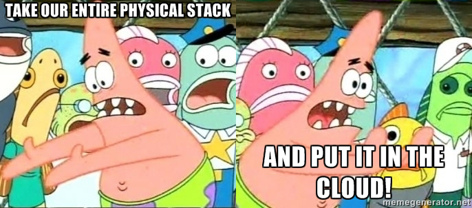
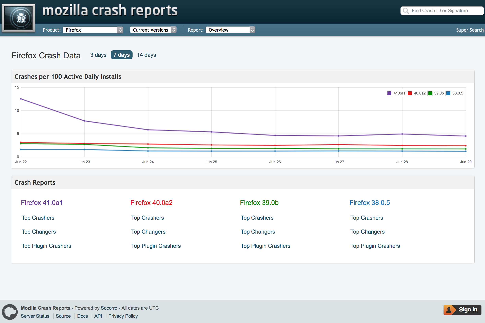

# **Genesis**

**Terraforming** a new environment for **Firefox** crash reporter

JP « **jdotpz** » Schneider **&** Dan « **phrawzty** » Maher

**Mozilla** Cloud Services and Engineering

---

# **Prologue**

Two data centres, both alike in dignity,
In fair Mozilla, where we lay our scene,
From ancient standards break to new paradigm,
Where civil syntax makes civil code unclean.
From forth the git repos of these two foes
A trio of star-cross’d devops engineers make their life;
Whose misadventured piteous overthrows
Do with their commits bury their managers’ strife.
The fearful passage of their markdown docs,
And the continuous deployment of their apps,
Is now the 45 minutes’ traffic of our stage.

^ With apologies W. Shakespeare

---

# **In all seriousness…**

^ In all seriousness, what are we here to talk about today?

---

# **Socorro (Crash-Stats)**

^ Sometimes Firefox crashes. (Sorry about that.) When that happens, the user has an opportunity to generate a crash report and send it to Mozilla for analysis.
We really, really want these reports. They do not disappear into the ether - we use them to help us guide our development process.

---

# ****

It was already built to be resilient to service degradation or failure; this was because Hadoop always broke.  We ended up writing in caching, spooling, and tolerance for things like nutty network partitions and so forth in each of our services (collection, processing, etc).
