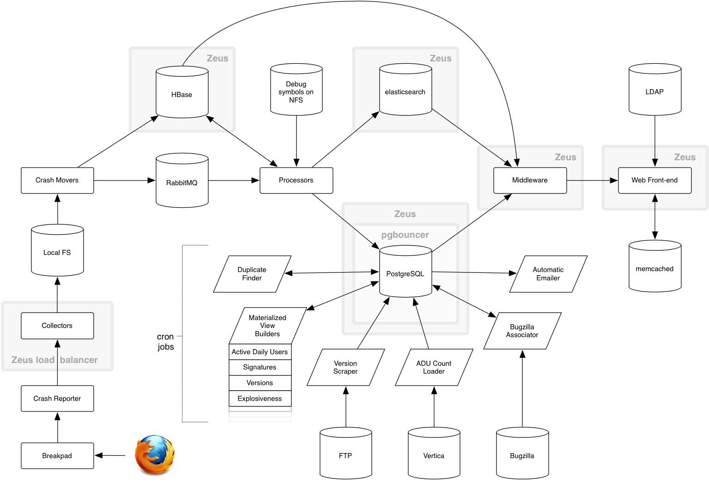

# **Genesis**

**Terraforming** a new environment for **Firefox** crash reporter

JP «**@jdotp**» Schneider **&** Dan «**@phrawzty**» Maher

**Mozilla** Cloud Services and Engineering

---

# **Prologue**

Two data centres, both alike in dignity,
In fair Mozilla, where we lay our scene,
From ancient standards break to new paradigm,
Where civil syntax makes civil code unclean.
From forth the git repos of these two foes
A trio of star-cross’d devops engineers make their life;
Whose misadventured piteous overthrows
Do with their commits bury their managers’ strife.
The fearful passage of their markdown docs,
And the continuous deployment of their apps,
Is now the 45 minutes’ traffic of our stage.

^ With apologies W. Shakespeare

---

# **In all seriousness…**

^ In all seriousness, what are we here to talk about today?

---

# **Socorro (Crash-Stats)**

^ Sometimes Firefox crashes. (Sorry about that.) When that happens, the user has an opportunity to generate a crash report and send it to Mozilla for analysis.
We really, really want these reports. They do not disappear into the ether - we use them to help us guide our development process.

---

# **A brief history of everything**

The entire stack that deals with those crash reports is code-named **Socorro**, the code for which is totally open source:
*https://github.com/mozilla/socorro/*

Effectively a bunch of Python applications and supporting services including a variety of databases we found lying around on the Internet.

12-factor-esque.

^ Ok, it’s not pure 12-factor, but it’s damn close so we just pretended.
Other companies use Socorro so we need to be aware that our development actions have consequences.

---

# **Moving parts**

^ This isn’t a talk about Socorro, but we need to establish scope - so let’s talk about Socorro.
Crashes are binary blobs. These are sent to our **Collectors** (which **collect**), then on to our **Processors** (which **process**).
From here, a lot of things can happen, many of which involve gently massaging the data and then cramming into the aforementioned databases.
Oh there’s also a tonne of custom data sources because why not?

---

# **Failure is an option**

Designed to be **resilient** to service degradation or failure. Practically speaking this means **everything buffers**, spools, caches, retries, and so forth.

I’d like to say this was because we were good programmers that designed good software, but really it’s because we had 99 problems with HBase.

Effectively we had a code base that was generally OK when some of those moving parts ceased to move.

---

# **Ceph: a very short story**

^ Because 99 problems wasn’t enough, we decided to try out Ceph!

---

